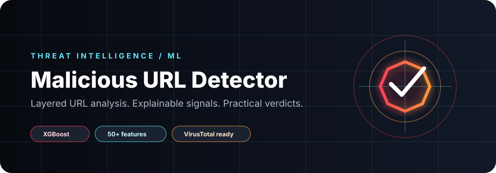

<p align="center"></p>

<p align="center"><strong>Machine-learning-assisted URL threat analysis for security learning, research, and defensive triage.</strong></p>

<p align="center"><code>Python</code> · <code>XGBoost</code> · <code>scikit-learn</code> · <code>tldextract</code> · <code>VirusTotal integration</code> · <code>SSL / IP signals</code></p>

<p align="center"></p>

## What this project does

Malicious URL Detector combines lexical URL signals, network context, certificate checks, machine-learning inference, optional external threat intelligence, and rule-based risk aggregation into one interactive analysis flow.

The repository is designed as an educational and defensive security project: enter a URL, collect evidence, classify the risk, and produce a human-readable verdict rather than relying on a single opaque signal.

<p align="center"></p>

## Detection layers

<table>
<tr>
<td width="25%" valign="top"><br><strong>URL & network inspection</strong><br>Validation, normalization, reachability, IP context and SSL checks.</td>
<td width="25%" valign="top"><br><strong>Feature-driven ML</strong><br>50+ extracted signals feed the XGBoost-based classification layer.</td>
<td width="25%" valign="top"><br><strong>Threat intelligence</strong><br>VirusTotal integration can provide an additional multi-engine signal when configured.</td>
<td width="25%" valign="top"><br><strong>Verdict & evidence</strong><br>Risk scoring, malware-type classification, CLI output and CSV-oriented logging.</td>
</tr>
</table>

## Architecture

The documented analysis path is:

```text
User URL
   |
   v
Validation & sanitization
   |
   v
Reachability + SSL verification
   |
   v
50+ feature extraction
   |
   +------> XGBoost classifier
   |
   +------> VirusTotal signal (optional/configured)
   |
   v
Threat classification -> risk scoring -> final verdict
   |
   +------> display/reporting
   +------> local logging/storage
```

This layered design is useful for studying how heuristic, contextual and ML signals can complement one another in a defensive workflow.

## Verdict model

The CLI can communicate progressive risk states such as `SAFE`, `QUESTIONABLE`, `SUSPICIOUS`, `HIGH_RISK`, and `MALICIOUS`. Treat these as decision-support outputs, not as a guarantee that a URL is safe or harmful.

## Repository map

```text
malicious-url-detector/
├─ url_detector.py             main detector and interactive flow
├─ Architecture.txt            reference pipeline
├─ requirements.txt            Python dependencies
├─ data/                       small training/sample datasets
├─ malicious links/            curated suspicious URL examples
├─ notebooks/                  analysis workspace
├─ assets/readme/              custom README visual system
└─ organize.bat                repository utility script
```

## Quick start

```bash
git clone https://github.com/cassielxyz/malicious-url-detector.git
cd malicious-url-detector
python -m venv .venv
```

Windows:

```powershell
.\.venv\Scripts\Activate.ps1
pip install -r requirements.txt
python url_detector.py
```

Linux / macOS:

```bash
source .venv/bin/activate
pip install -r requirements.txt
python url_detector.py
```

Core dependencies include `pandas`, `numpy`, `scikit-learn`, `xgboost`, `tldextract`, `requests`, `validators`, `beautifulsoup4`, and `joblib`.

## Interactive workflow

Run `python url_detector.py`, then provide a URL for analysis. The project also documents commands for viewing statistics, supported threat types, recent findings, help, and exit behavior.

When external intelligence is enabled, keep API credentials outside source control. Do not hard-code secrets into `url_detector.py`, notebooks, datasets, examples, or documentation.

## Security boundaries

- A URL classified as safe can still become malicious later.
- Network requests to untrusted destinations should be treated as hostile input.
- External API results are signals, not authoritative truth.
- Never execute downloaded content as part of URL analysis.
- Keep API keys in local environment configuration and rotate any credential that has ever been published.
- Use this project only against URLs and infrastructure you are authorized to test.

## Data and model notes

The repository includes compact sample datasets and curated suspicious-link lists for experimentation. Model quality depends on dataset quality, feature drift, class balance, adversarial adaptation, and the environment in which the detector is evaluated. Report measured results with the dataset split and test conditions rather than treating a single accuracy number as universal.

## Extending the detector

Useful directions for contributors include adding stronger feature provenance, reproducible train/evaluation scripts, calibration metrics, richer explainability, URL redirection-chain analysis, safer network sandboxing, model/version manifests, and automated regression tests for known benign and malicious samples.

## Discoverability keywords

Recommended GitHub topics for this repository:

`cybersecurity` · `malicious-url-detection` · `phishing-detection` · `machine-learning` · `xgboost` · `threat-intelligence` · `url-analysis` · `python` · `security-tools` · `phishing` · `network-security`

## Responsible use

This project is intended for education, research, security awareness, and authorized defensive analysis. Do not use it to probe systems you do not own or have permission to assess.

<p align="center"></p>
<p align="center"><sub>Built as a practical bridge between machine learning and defensive URL analysis.</sub></p>
